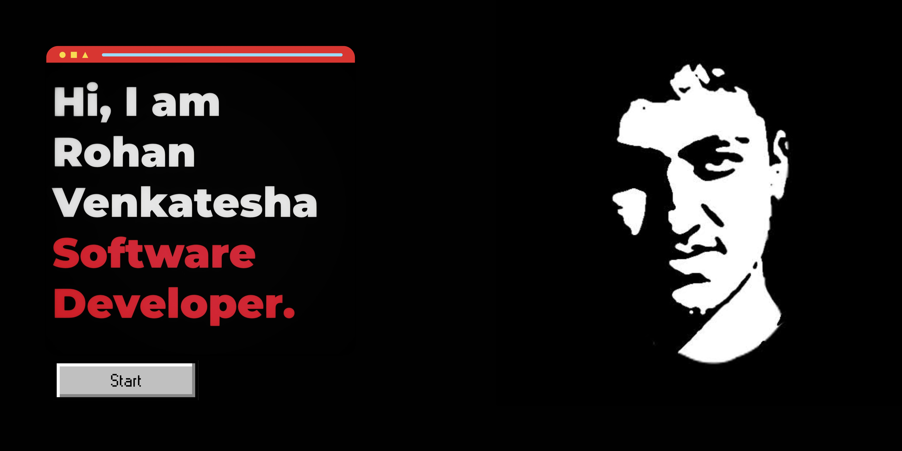

  

## 🤖 About Me
I am a **Python AI Engineer** focused on scaling production-grade Generative AI solutions, Agentic multi-agent systems, and highly optimized enterprise data pipelines. 

* 🚀 **Current Focus**: Designing low-latency multimodal RAG architectures, token-aware semantic retrievers, and LangGraph multi-agent orchestration frameworks.
* 🛠️ **Cloud Ecosystem**: Heavily specialized in Google Cloud Platform (Vertex AI, Document AI, Cloud Run) and hybrid cloud infrastructure.
* 🧠 **Specialties**: Prompt engineering, vector indexing (pgvector), custom Model Context Protocol (MCP) servers, and real-time computer vision operations.

---

## 🌐 Connect With Me:

  &nbsp;&nbsp;&nbsp;&nbsp;
  

---

## 🛠️ Tech Stack & Ecosystem

### 🧠 Artificial Intelligence & GenAI

  
  
  
  
  
  

### 💻 Core Languages & Backends

  
  
  
  
  
  

### 🗄️ Databases & Vector Storage

  
  
  
  

### ☁️ Infrastructure & DevOps

  
  
  
  

---

## 📊 Live Developer Metrics

Here are my live, auto-updating metrics using the verified stable `github-readme-stats` and `streak-stats` APIs configured properly with a dark-mode theme block layout:

  <table border="0">
    <tr>
      <td>
        
      </td>
      <td>
        
      </td>
    </tr>
    <tr>
      <td colspan="2" align="center">
        
      </td>
    </tr>
  </table>

---

## 🔥 What I Do in Production

* **⚡ RAG & Semantic Search Optimization**: Architected multimodal retrieval systems using token-aware chunking strategies and re-rankers, slashing context window bloat by 50%.
* **🤖 Multi-Agent Orchestration**: Deployed stateful conversational workflows using LangGraph to tie isolated runtime tools, compilers, and validation nodes together.
* **🔧 Core Backend Scaling**: Optimized FastAPI and enterprise database architectures, cutting high-throughput API response bottlenecks significantly.

---

## 📚 Let's Collaborate
I am always open to discussing advanced AI engineering implementations, custom Model Context Protocol (MCP) extensions, or database scaling challenges. Feel free to explore my repositories or drop a message on LinkedIn if you want to collaborate!
